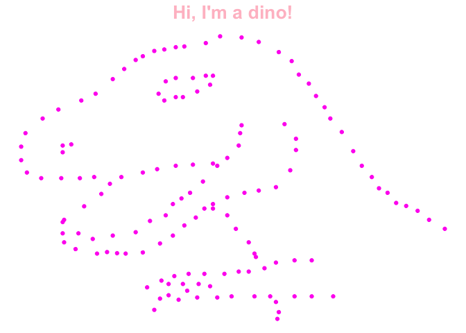

Lab1
================
Jo Starenky
2024-09-16

# Load Packages

``` r
library(haven)
library(tidyr)
```

    ## Warning: package 'tidyr' was built under R version 4.2.3

``` r
library(ggplot2)
```

    ## Warning: package 'ggplot2' was built under R version 4.2.3

``` r
library(datasauRus)
```

    ## Warning: package 'datasauRus' was built under R version 4.2.3

``` r
library(dplyr)
```

    ## Warning: package 'dplyr' was built under R version 4.2.3

    ## 
    ## Attaching package: 'dplyr'

    ## The following objects are masked from 'package:stats':
    ## 
    ##     filter, lag

    ## The following objects are masked from 'package:base':
    ## 
    ##     intersect, setdiff, setequal, union

# First look of descriptive statistics

``` r
datasaurus_dozen %>% 
  group_by(dataset) %>%
  dplyr::summarize(mean_x    = mean(x),
      mean_y    = mean(y),
      std_dev_x = sd(x),
      std_dev_y = sd(y),
      corr_x_y  = cor(x, y)
    )
```

    ## # A tibble: 13 × 6
    ##    dataset    mean_x mean_y std_dev_x std_dev_y corr_x_y
    ##    <chr>       <dbl>  <dbl>     <dbl>     <dbl>    <dbl>
    ##  1 away         54.3   47.8      16.8      26.9  -0.0641
    ##  2 bullseye     54.3   47.8      16.8      26.9  -0.0686
    ##  3 circle       54.3   47.8      16.8      26.9  -0.0683
    ##  4 dino         54.3   47.8      16.8      26.9  -0.0645
    ##  5 dots         54.3   47.8      16.8      26.9  -0.0603
    ##  6 h_lines      54.3   47.8      16.8      26.9  -0.0617
    ##  7 high_lines   54.3   47.8      16.8      26.9  -0.0685
    ##  8 slant_down   54.3   47.8      16.8      26.9  -0.0690
    ##  9 slant_up     54.3   47.8      16.8      26.9  -0.0686
    ## 10 star         54.3   47.8      16.8      26.9  -0.0630
    ## 11 v_lines      54.3   47.8      16.8      26.9  -0.0694
    ## 12 wide_lines   54.3   47.8      16.8      26.9  -0.0666
    ## 13 x_shape      54.3   47.8      16.8      26.9  -0.0656

# Introduce GGplot

``` r
ggplot(datasaurus_dozen, aes(x = x, y = y, colour = dataset))+
    geom_point() + facet_wrap(~dataset)
```

<!-- -->

``` r
dino<- datasaurus_dozen %>%
  filter(dataset == "dino")

ggplot(dino, aes(x = x, y = y))+
  geom_point (color="#FF13F0") + theme_void() + labs(title = "Hi, I'm a dino!") + theme(plot.title = element_text(hjust = 0.5, face = "bold", size = 20, color = "pink"))
```

<!-- -->

# Q1: What is the function of facet wrap? In what situation do you think you will use this function?

# Q2: The means, standard deviations, and correlations are pretty much the same, but the data pattern looks very different for each dataset. What is the implication here?
